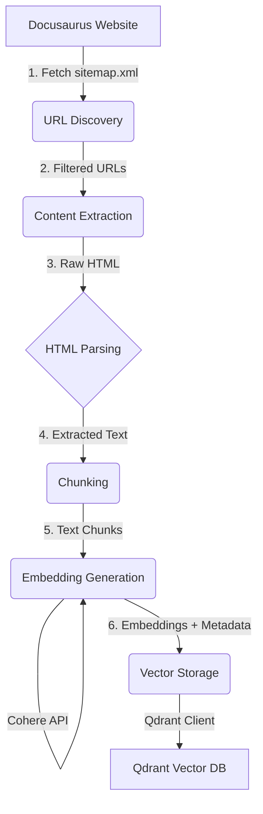

# Implementation Plan: RAG Content Ingestion Pipeline

**Feature Branch**: `001-content-ingestion-pipeline`
**Feature Spec**: [spec.md](./spec.md)
**Status**: In Progress

## 1. Technical Context & Architecture

### 1.1. Core Technologies
- **Python**: The language for the entire backend pipeline.
- **UV**: For Python environment and dependency management.
- **Docusaurus (Source)**: The static site generator for the source content.
- **Requests/BeautifulSoup**: For fetching and parsing HTML content.
- **Cohere**: For generating text embeddings.
- **Qdrant**: The vector database for storing embeddings and metadata.

### 1.2. Architectural Overview
The system will be a linear pipeline script executed from the `backend/` workspace. It is not a long-running service.

**Data Flow Diagram**:


### 1.3. Dependencies & Boundaries
- **External Dependencies**:
  - Deployed Docusaurus website must be live and accessible.
  - Cohere API endpoint must be available.
  - Qdrant database instance must be running and accessible.
- **Internal Boundaries**:
  - The entire pipeline is self-contained within the `backend/` directory.
  - It has no direct interaction with the `website/` Docusaurus source code, only the deployed output.
  - It produces data for future RAG agent use but does not interact with any agent logic itself.

## 2. Constitution Check & Gates

- **[✔] Accuracy**: The pipeline ensures accuracy by linking all data back to its source URL.
- **[✔] Clarity**: The data model is designed for clarity with explicit metadata for each chunk.
- **[✔] Reproducibility**: The ingestion process is designed to be idempotent and deterministic, ensuring reproducibility.
- **[✔] Rigor**: Technology choices (Cohere, Qdrant) are standard for RAG implementations.
- **[✔] Plagiarism**: Not applicable for this technical pipeline, as it processes existing content.

**Gate Evaluation**: No violations of the project constitution are anticipated. The plan aligns with core principles.

## 3. Phase 0: Research & Decisions

All research and decisions will be documented in [research.md](./research.md). Key areas to investigate:

- **R-01**: Best Python library for parsing Docusaurus-generated HTML (`BeautifulSoup` vs. `lxml`).
- **R-02**: Optimal chunking strategy (size and overlap) for technical book content to balance context preservation and retrieval precision.
- **R-03**: Qdrant configuration for optimal performance with Cohere embeddings (e.g., distance metric, indexing).

## 4. Phase 1: Design & Contracts

### 4.1. Project Setup
- A `backend/` directory will be created at the project root.
- Inside `backend/`, a Python project will be initialized using `uv init`.
- A `requirements.txt` will be defined with initial dependencies: `uv`, `requests`, `beautifulsoup4`, `cohere`, `qdrant-client`, `python-dotenv`.
- The folder structure will be:
  ```
  backend/
  ├── .env.example
  ├── config/
  ├── ingestion/
  │   ├── discovery.py
  │   ├── extraction.py
  │   └── chunking.py
  ├── embeddings/
  │   └── generator.py
  ├── vector_store/
  │   └── qdrant_manager.py
  ├── scripts/
  │   └── run_pipeline.py
  └── logs/
  ```

### 4.2. Data Model
The detailed data model for the vector payload will be documented in [data-model.md](./data-model.md).

### 4.3. API Contracts
- No external API contracts are required for this feature, as it is a self-contained, internal data pipeline. The "contracts" are the data structures passed between internal modules.

### 4.4. Quickstart Guide
A developer quickstart guide will be created at [quickstart.md](./quickstart.md) detailing environment setup, credential configuration, and pipeline execution steps.

## 5. Phase 2: Implementation & Testing (High-Level)

*This section is for planning only; implementation will occur in a later ticket.*

- **Task 1: Foundation**: Implement the project setup as defined in section 4.1.
- **Task 2: Discovery**: Implement the `discovery.py` module to fetch and parse the sitemap.
- **Task 3: Extraction & Chunking**: Implement `extraction.py` and `chunking.py` to process HTML into text chunks.
- **Task 4: Embeddings**: Implement `generator.py` to call the Cohere API.
- **Task 5: Storage**: Implement `qdrant_manager.py` to handle communication with Qdrant.
- **Task 6: Pipeline Script**: Create the main `run_pipeline.py` script to orchestrate all phases.
- **Task 7: Validation**: Write a validation script to query Qdrant and verify that the stored data matches a sample from the source website, confirming the end-to-end process works as expected.

## 6. Follow-up & Risks

- **Risk**: The structure of the deployed Docusaurus HTML may change, breaking the parsing logic. **Mitigation**: The parsing logic should be made as robust as possible, and error logging should be comprehensive.
- **Risk**: API rate limits from Cohere could slow down the process. **Mitigation**: Implement batching and potentially a delay mechanism in the embedding generation step.
- **Follow-up**: Create a separate task for building the RAG agent that will consume the data produced by this pipeline.