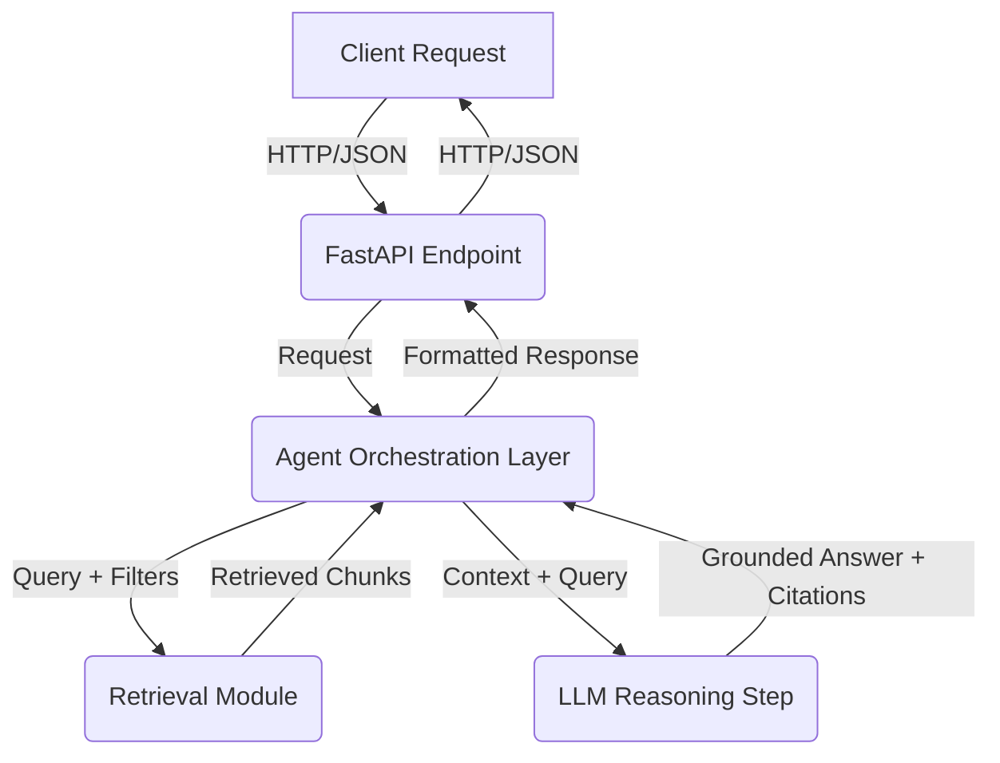

# Implementation Plan: RAG Agent Construction with FastAPI

**Feature Branch**: `006-rag-agent-construction`
**Feature Spec**: [spec.md](./spec.md)
**Status**: In Progress

## 1. Architecture Overview

### 1.1. High-Level Architecture

This architecture clearly delineates responsibilities:
-   **API Transport Layer**: Handled by FastAPI, defining external contract.
-   **Agent Reasoning Layer**: Orchestrates the interaction between retrieval and LLM.
-   **Retrieval Logic**: Provided by the validated module from Spec-005, serving as the agent's knowledge base.

## 2. Agent Design

### 2.1. Agent Role & Boundaries
-   **Purpose**: The agent's sole purpose is to answer user questions about the book content.
-   **Knowledge Constraint**: The agent MUST synthesize answers strictly from the information provided by the retrieval module. It must NOT rely on its pre-trained internal knowledge about the book (beyond basic language understanding) or external, non-book sources.
-   **No External Tools**: The agent will not use external tools beyond the retrieval module for information gathering.

### 2.2. Agent Inputs
-   **User Query**: The primary input, a natural language question (e.g., "What is a URDF model?").
-   **Optional Constraints**:
    -   `source_url_constraint` (string): Limits retrieval to chunks from a specific URL.
    -   `section_constraint` (string): Limits retrieval to chunks from a specific section/heading within a page.
    -   (Future consideration: `selected_text_constraint` for answering based on a provided text snippet, but this will be passed to the LLM directly, not the retrieval module).

### 2.3. Agent Reasoning Flow
1.  **Receive Request**: FastAPI endpoint accepts `AgentRequest`.
2.  **Generate Query Embedding**: The user's `query` is passed to the `EmbeddingGenerator` to produce a query embedding.
3.  **Invoke Retrieval Pipeline**: The query embedding, along with `source_url_constraint` and `section_constraint` (if provided), is sent to the retrieval module (from Spec-005) to fetch `top-k` relevant `RetrievedChunk` objects.
4.  **Construct Reasoning Context**:
    -   The `raw_text` from the `RetrievedChunk` objects will be concatenated to form the context for the LLM.
    -   Citations (source URL, section) will be extracted and formatted alongside the context.
    -   **Truncation Strategy**: If the combined context exceeds the LLM's context window, a truncation strategy (e.g., prioritize by score, then by document order) will be applied.
5.  **LLM Reasoning Step**:
    -   The constructed context and the original user query are provided to the LLM (via OpenAI Agents SDK).
    -   The LLM is prompted to synthesize an answer *grounded solely in the provided context*.
    -   The LLM is also prompted to generate inline citations or list sources used.
6.  **Produce Grounded Answer with Citations**: The LLM's response is parsed to extract the final answer and any generated citations.
7.  **Return Response**: The FastAPI endpoint returns an `AgentResponse` containing the answer and structured citations.

## 3. Retrieval Integration

-   **Invocation**: The agent orchestration layer will directly call the `search` method of the `Retriever` class (from Spec-005).
-   **Formatting for LLM**: Retrieved `RetrievedChunk` objects will be converted into a suitable string format for the LLM's prompt. This format will include the `raw_text` and associated metadata necessary for grounding and citation. Example: `"[DOCUMENT 1 (Source: url.com, Section: ...)] This is the text... [END DOCUMENT]"`
-   **Context Ordering**: Retrieved chunks will be ordered by their similarity score (descending) before being passed to the LLM.
-   **Citation Generation**: The agent's prompt will explicitly instruct the LLM to include citations based on the provided metadata. The response parsing step will then extract and structure these citations.

## 4. FastAPI Backend Design

### 4.1. API Endpoint Structure
-   **Endpoint**: `POST /agent/ask`
-   **Request Body**: `AgentRequest` (Pydantic model)
-   **Response Body**: `AgentResponse` (Pydantic model)

### 4.2. Request Schema
-   **`AgentRequest`**:
    -   `query` (string, required): The user's natural language question.
    -   `source_url_constraint` (string, optional): URL to filter retrieval.
    -   `section_constraint` (string, optional): Section title to filter retrieval.

### 4.3. Response Schema
-   **`AgentResponse`**:
    -   `answer` (string, required): The agent's synthesized answer.
    -   `citations` (List[Dict], required): A list of objects, each with `source_url`, `section`, `raw_text_snippet` (the specific text from the chunk that was cited, if possible, or the full chunk text).
    -   `message` (string, optional): An informational message (e.g., "Cannot answer based on knowledge source").

### 4.4. Error Handling and Response Normalization
-   **Validation Errors**: FastAPI's automatic Pydantic validation for requests.
-   **Agent Errors**: Catch exceptions from the agent or retrieval, log them, and return a user-friendly error message in `AgentResponse`.
-   **Empty Answers**: If the agent cannot formulate an answer, return a specific message and an empty citations list.

## 5. Constraint Enforcement

-   **"Answer using retrieved content only"**: Enforced via LLM prompting (system instructions) and agent design (no external tools). The context provided to the LLM will explicitly come *only* from retrieval results.
-   **"Answer using only selected text"**: If `source_url_constraint` or `section_constraint` are provided, they are passed directly to the retrieval module. The agent's prompt will further instruct the LLM to adhere to these constraints during answer synthesis.
-   **Maximum Context Size Limits**: Handled by truncating retrieved chunks if the combined context exceeds the LLM's token limit, as part of the context construction strategy.

## 6. Decisions Needing Documentation

All research and decisions will be documented in [research.md](./research.md). Key areas to investigate and justify:
-   **R-01**: Specific OpenAI Agents SDK components to use (e.g., `AgentExecutor`, custom tools).
-   **R-02**: Exact LLM prompting strategy for grounding and citation generation.
-   **R-03**: Context construction and truncation strategy (e.g., simple concatenation vs. re-ranking retrieved chunks).
-   **R-04**: Citation parsing and formatting from the LLM's response.

## 7. Testing & Validation Strategy

Validation checks will be aligned with the acceptance criteria from `spec.md`:
-   **Grounded Answers**: Automated test suite for various questions; human evaluation for accuracy and grounding (SC-001).
-   **Citation Correctness**: Tests will verify presence and accuracy of citations (SC-002).
-   **Constraint Adherence**: Test cases with `source_url` and `section` constraints to ensure agent adheres to boundaries (SC-003).
-   **Latency Benchmarks**: Measure FastAPI endpoint response times (SC-004).
-   **Determinism**: Verify identical inputs yield identical responses (SC-005).
-   **API Schema Compliance**: Automated checks for request/response schema.

## 8. Quality & Governance

-   All architectural and quality rules from `sp.constitution` will be followed.
-   The plan is organized by logical phases:
    -   Agent Design (core logic, tools)
    -   Retrieval Integration (how agent uses retriever)
    -   API Exposure (FastAPI endpoint)
    -   Validation (testing strategies)

### Exclusions:
-   No frontend rendering.
-   No session-based conversation memory.
-   No streaming responses.