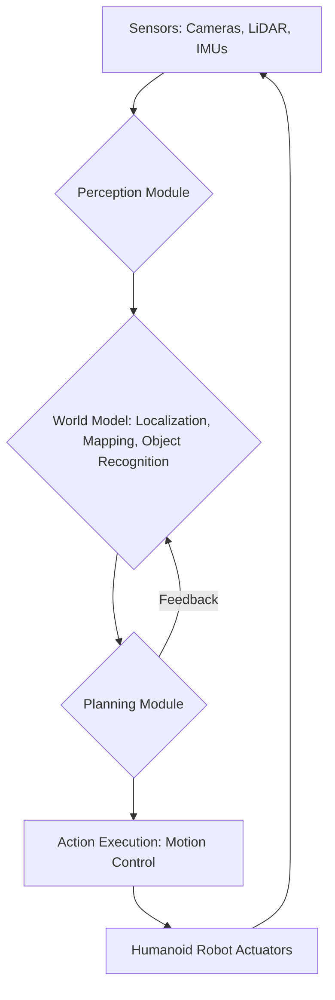

# Chapter 1 - Introduction to the AI-Robot Brain

## The Intelligence Behind Humanoid Robotics

Humanoid robots are complex machines designed to operate in human-centric environments. To achieve true autonomy, they need more than just sophisticated hardware; they require an "AI-Robot Brain" that enables them to perceive their surroundings, make intelligent decisions, and execute actions effectively. This module delves into the core cognitive functions of humanoid robots: perception and planning.

### The Critical Role of Perception and Planning

*   **Perception**: This is the robot's ability to "sense" and interpret its environment. It involves processing data from various sensors (cameras, LiDAR, IMUs) to understand objects, recognize locations, and build a representation of the world. For a humanoid, robust perception is crucial for tasks like recognizing a door, avoiding obstacles, or identifying a target object to manipulate.
*   **Planning**: Once a robot perceives its environment, it needs to plan how to act. Planning involves generating sequences of actions to achieve a goal, considering constraints, obstacles, and the robot's own capabilities. This can range from high-level task planning (e.g., "go to the kitchen") to low-level motion planning (e.g., how to move its arm to pick up a cup without collision).

#### **Visualization: AI-Robot Brain Architecture Overview**

*Description*: A flowchart illustrating the typical architecture of an AI-Robot Brain. Sensors (Cameras, LiDAR, IMUs) feed data into the Perception Module. The Perception Module builds a World Model (Localization, Mapping, Object Recognition). The World Model informs the Planning Module, which then dictates Action Execution (Motion Control) to the Humanoid Robot Actuators. Feedback from action execution can update the World Model.

## Overview of the NVIDIA Isaac Ecosystem

NVIDIA Isaac provides a comprehensive platform for robotics development, offering tools for simulation, perception, and AI. It's built to accelerate the development and deployment of robotics applications, especially those leveraging NVIDIA GPUs.

### Key Components:

*   **NVIDIA Isaac Sim**: A scalable, cloud-native robotics simulation platform built on NVIDIA Omniverse. It offers photorealistic rendering, advanced physics, and an extensible SDK for creating, simulating, and testing robot applications. Isaac Sim is invaluable for generating synthetic data, which is critical for training robust AI models without the limitations of real-world data collection.
*   **Isaac ROS**: A collection of hardware-accelerated ROS 2 packages that leverage NVIDIA GPUs for high-performance robotics workloads. Isaac ROS modules provide optimized solutions for perception (e.g., VSLAM, object detection), navigation, and manipulation, integrating directly into the ROS 2 framework.

## The Relationship Between Simulation and Real-World Deployment

Simulation plays a pivotal role in modern robotics development. It allows developers to:
*   **Rapidly Prototype**: Test new algorithms and designs much faster than with physical hardware.
*   **Generate Synthetic Data**: Create diverse and massive datasets to train AI models, overcoming the challenges of real-world data acquisition. This synthetic data can be enriched with ground truth labels (e.g., perfect depth maps, object bounding boxes) that are impossible to get from real sensors.
*   **Test Edge Cases**: Explore dangerous or rare scenarios that would be unsafe or impractical to test on a physical robot.
*   **Accelerate Development**: Iteratively develop and refine robotic behaviors in a controlled virtual environment before deploying to physical hardware.

The ultimate goal is to achieve "sim2real" transfer, where models and behaviors learned in simulation perform equally well when deployed on physical robots. NVIDIA Isaac's photorealistic capabilities and physics accuracy are designed specifically to minimize the "reality gap" and improve sim2real performance.

## Module Structure

This module will guide you through the following key areas:
*   **Chapter 2**: Setting up Isaac Sim for photorealistic simulation and mastering synthetic data generation for RGB-D and LiDAR sensors.
*   **Chapter 3**: Integrating Isaac ROS for hardware-accelerated VSLAM, enabling real-time localization and mapping in simulated environments.
*   **Chapter 4**: Configuring the Nav2 stack for bipedal humanoid robots, focusing on path planning and obstacle avoidance.
*   **Chapter 5**: A micro-project that combines all learned concepts into a full autonomous navigation pipeline, including mission execution and lab report generation.

By the end of this module, you will have a comprehensive understanding and practical experience in developing the AI-Robot Brain for humanoid robots in a powerful simulated environment.

## Glossary

*   **Perception**: The process by which a robot senses and interprets its environment using sensor data.
*   **Planning**: The process of generating actions or sequences of actions to achieve a goal.
*   **NVIDIA Isaac Sim**: A scalable, cloud-native robotics simulation platform for creating, simulating, and testing robot applications.
*   **Isaac ROS**: Hardware-accelerated ROS 2 packages for high-performance robotics workloads.
*   **VSLAM (Visual Simultaneous Localization and Mapping)**: A technique used by robots to simultaneously build a map of an unknown environment and determine their own position within it using visual input.
*   **Nav2 (Navigation2)**: The standard ROS 2 navigation stack for autonomous mobile robot navigation.
*   **Synthetic Data**: Data generated artificially in a simulated environment, often used for training AI models.
*   **Sim2Real**: The process of transferring knowledge or skills learned in simulation to a real-world robotic system.

## References

*   [NVIDIA Isaac Sim Documentation](https://docs.omniverse.nvidia.com/app_isaacsim/app_isaacsim/overview.html)
*   [NVIDIA Isaac ROS Documentation](https://nvidia-isaac-ros.github.io/index.html)
*   [ROS 2 Documentation](https://docs.ros.org/en/humble/index.html)
*   [Nav2 Documentation](https://navigation.ros.org/)