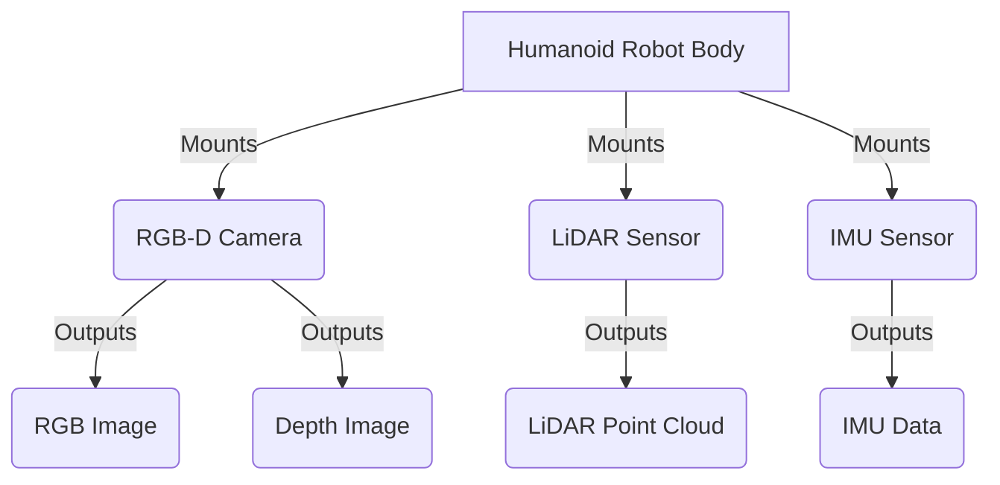

# Chapter 2 - Photorealistic Simulation & Synthetic Data

## Introduction to Photorealistic Simulation with NVIDIA Isaac Sim

NVIDIA Isaac Sim, built on the Omniverse platform, offers a powerful environment for photorealistic simulation and synthetic data generation. Unlike traditional simulators, Isaac Sim provides high-fidelity visuals, advanced physics, and seamless integration with NVIDIA's AI and robotics tools, making it ideal for training robust AI models for humanoid robots.

### Why Photorealistic Simulation?

Photorealistic simulations bridge the reality gap, allowing AI models trained in simulation to perform effectively in the real world. Key benefits include:
*   **Safety**: Test complex robot behaviors in a risk-free virtual environment.
*   **Cost-effectiveness**: Reduce expenses associated with physical hardware and real-world data collection.
*   **Scalability**: Easily generate vast amounts of diverse data (synthetic data) that would be difficult or impossible to acquire in reality.
*   **Reproducibility**: Experiments can be precisely replicated under identical conditions.

#### **Visualization: Synthetic Data Generation Pipeline**

```mermaid
graph TD
    A[Isaac Sim Environment] --> B{Virtual Sensors}
    B --> C{Synthetic Data (RGB-D, LiDAR)}
    C --> D[AI Model Training]
    D -- Deployed --> E[Real-World Humanoid Robot]
```
*Description*: A flowchart illustrating the synthetic data generation pipeline. The Isaac Sim Environment contains Virtual Sensors (e.g., camera, LiDAR). These sensors output Synthetic Data (RGB-D, LiDAR), which is then used for AI Model Training. The trained AI Model is then Deployed to a Real-World Humanoid Robot.


## Setting Up Your Isaac Sim Environment

This section guides you through the initial setup of an Isaac Sim environment and the loading of a humanoid robot model.

### Prerequisites

Ensure you have:
1.  **NVIDIA Isaac Sim Installed**: Refer to the Quickstart Guide (`specs/001-isaac-ai-robot-brain/quickstart.md`) for installation instructions.
2.  **Isaac Sim Running**: Launch Isaac Sim from the NVIDIA Omniverse Launcher.

### Loading a Humanoid Robot and Environment

We will use the `load_humanoid.py` script to programmatically load a humanoid robot and a simple environment into Isaac Sim.

1.  **Examine `load_humanoid.py`**:
    Navigate to `module3-ai-robot-brain/ros2_packages/src/isaac_sim_integration/scripts/load_humanoid.py`.
    ```python
    # module3-ai-robot-brain/ros2_packages/src/isaac_sim_integration/scripts/load_humanoid.py
    import carb
    from omni.isaac.kit import SimulationApp

    CONFIG = {"headless": False}
    simulation_app = SimulationApp(CONFIG)

    import omni.timeline
    import omni.isaac.core as ic
    from omni.isaac.core.utils.nucleus import get_assets_root_path
    from omni.isaac.core.utils.stage import add_reference_to_stage
    from omni.isaac.core.articulations import Articulation # Import Articulation

    class HumanoidLoader:
        def __init__(self):
            self.kit = simulation_app
            self.stage = ic.get_current_stage()
            self.timeline = omni.timeline.get_timeline_interface()
            self.assets_root_path = get_assets_root_path()
            if self.assets_root_path is None:
                carb.log_error("Could not find Isaac Sim assets folder")
                simulation_app.close()
                exit()

        def load_humanoid(self, humanoid_usd_path="/Isaac/Robots/Humanoid/humanoid_instanceable.usd", stage_path="/humanoid"):
            asset_path = self.assets_root_path + humanoid_usd_path
            add_reference_to_stage(asset_path, stage_path)
            # Add the articulation to the scene to make it controllable/simulatable
            world = ic.get_current_scene()
            if world:
                world.scene.add(Articulation(prim_path=stage_path, name="humanoid_robot"))
            print(f"Loaded humanoid from {asset_path} at {stage_path}")

        def load_environment(self, env_usd_path="/Isaac/Environments/Simple_Room.usd", stage_path="/World/Simple_Room"):
            asset_path = self.assets_root_path + env_usd_path
            add_reference_to_stage(asset_path, stage_path)
            print(f"Loaded environment from {asset_path} at {stage_path}")

        def run_simulation(self):
            self.timeline.play()
            for i in range(100): # Simulate for a few frames
                self.kit.update()
            self.timeline.stop()
            print("Simulation loaded and run briefly.")

        def __del__(self):
            if self.kit:
                self.kit.close()

    if __name__ == "__main__":
        world = ic.SimulationContext() # Initialize Isaac Sim World
        world.set_simulation_context(simulation_app.app.new_stage())
        world.add_ground_plane() # Add a ground plane

        humanoid_loader = HumanoidLoader()
        humanoid_loader.load_environment()
        humanoid_loader.load_humanoid()
        humanoid_loader.run_simulation()
        
        print("Humanoid and environment loaded. Close Isaac Sim window to exit script.")
        while simulation_app.is_running():
            simulation_app.update()

        del humanoid_loader
    ```

2.  **Run the Script**:
    Open a terminal and execute the script while Isaac Sim is running:
    ```bash
    python module3-ai-robot-brain/ros2_packages/src/isaac_sim_integration/scripts/load_humanoid.py
    ```
    You should see a humanoid robot model and a simple room environment appear in your Isaac Sim window.

## Generating Synthetic Sensor Datasets

Synthetic data is crucial for training AI models, especially when real-world data is scarce or expensive. Isaac Sim allows us to generate various sensor data, including RGB-D (color and depth) and LiDAR (point clouds).

#### **Visualization: Humanoid Robot with Sensors**


*Description*: A conceptual diagram showing a Humanoid Robot Body with various sensors mounted on it. These sensors (RGB-D Camera, LiDAR Sensor, IMU Sensor) output different types of data (RGB Image, Depth Image, LiDAR Point Cloud, IMU Data) which are critical for perception.

### Configuring and Attaching Sensors

The `configure_sensors.py` script demonstrates how to programmatically attach RGB-D cameras and LiDAR sensors to your simulated humanoid.


1.  **Examine `configure_sensors.py`**:
    Navigate to `module3-ai-robot-brain/ros2_packages/src/isaac_sim_integration/scripts/configure_sensors.py`.
    ```python
    # module3-ai-robot-brain/ros2_packages/src/isaac_sim_integration/scripts/configure_sensors.py
    import carb
    from omni.isaac.kit import SimulationApp

    CONFIG = {"headless": False}
    simulation_app = SimulationApp(CONFIG)

    import omni.timeline
    import omni.isaac.core as ic
    from omni.isaac.core.utils.nucleus import get_assets_root_path
    from omni.isaac.core.articulations import Articulation
    from omni.isaac.sensor import Camera, LidarRtx
    from omni.isaac.core.utils.stage import add_reference_to_stage # Import add_reference_to_stage

    class SensorConfigurator:
        def __init__(self):
            self.kit = simulation_app
            self.stage = ic.get_current_stage()
            self.timeline = omni.timeline.get_timeline_interface()
            self.assets_root_path = get_assets_root_path()
            if self.assets_root_path is None:
                carb.log_error("Could not find Isaac Sim assets folder")
                simulation_app.close()
                exit()

        def attach_sensors_to_humanoid(self, humanoid_prim_path="/humanoid", rgbd_name="humanoid_rgbd", lidar_name="humanoid_lidar"):
            world = ic.get_current_scene()
            # Ensure humanoid exists in the scene before trying to get it
            try:
                humanoid = world.get_articulation(prim_path=humanoid_prim_path)
            except Exception:
                # If humanoid is not found, add a placeholder for standalone execution
                print(f"Humanoid at {humanoid_prim_path} not found. Adding temporary humanoid for sensor attachment.")
                humanoid_usd_path = self.assets_root_path + "/Isaac/Robots/Humanoid/humanoid_instanceable.usd"
                add_reference_to_stage(humanoid_usd_path, humanoid_prim_path)
                world.scene.add(Articulation(prim_path=humanoid_prim_path, name="humanoid_robot"))
                world.reset()
                world.render()
                humanoid = world.get_articulation(prim_path=humanoid_prim_path)


            # Attach RGB-D Camera to base_link
            head_link_prim_path = f"{humanoid_prim_path}/base_link" 
            camera = Camera(
                prim_path=f"{head_link_prim_path}/{rgbd_name}",
                position=ic.utils.buffers.np.array([0.1, 0.0, 0.1]),
                orientation=ic.utils.buffers.np.array([1.0, 0.0, 0.0, 0.0]),
                resolution=(640, 480),
                fov_y=60.0,
                focal_length=2.4,
                clipping_range=(0.1, 100000.0)
            )
            camera.add_depth_to_stream() # Enable depth data
            print(f"Attached RGB-D camera '{rgbd_name}' to {head_link_prim_path}")

            # Attach LiDAR to base_link
            lidar = LidarRtx(
                prim_path=f"{head_link_prim_path}/{lidar_name}",
                position=ic.utils.buffers.np.array([0.1, 0.0, 0.2]),
                orientation=ic.utils.buffers.np.array([1.0, 0.0, 0.0, 0.0]),
                min_range=0.4,
                max_range=20.0,
                draw_points=True,
                horizontal_fov=360.0,
                vertical_fov=30.0,
                horizontal_resolution=0.4,
                vertical_resolution=4.0,
                rotation_rate=10.0,
                high_lod=True
            )
            print(f"Attached LiDAR '{lidar_name}' to {head_link_prim_path}")

            return camera, lidar

        def run_simulation(self):
            self.timeline.play()
            for _ in range(100): # Simulate for a few frames
                self.kit.update()
            self.timeline.stop()
            print("Simulation loaded and run briefly.")

        def __del__(self):
            if self.kit:
                self.kit.close()

    if __name__ == "__main__":
        world = ic.SimulationContext()
        world.set_simulation_context(simulation_app.app.new_stage())
        world.add_ground_plane()

        sensor_config = SensorConfigurator()
        camera, lidar = sensor_config.attach_sensors_to_humanoid(humanoid_prim_path="/humanoid")
        
        sensor_config.run_simulation()
        
        print("Sensors configured. Close Isaac Sim window to exit script.")
        while simulation_app.is_running():
            simulation_app.update()

        del sensor_config
    ```

2.  **Run the Script**:
    Execute the script with Isaac Sim running. You should see the humanoid and confirmation messages in the console about sensor attachment.
    ```bash
    python module3-ai-robot-brain/ros2_packages/src/isaac_sim_integration/scripts/configure_sensors.py
    ```

## Hands-on: Capturing RGB-D and LiDAR Data

With sensors configured, we can now capture synthetic data.

### Capturing RGB-D Data

The `capture_rgbd.py` script captures color and depth images from the attached RGB-D camera.

1.  **Examine `capture_rgbd.py`**:
    Navigate to `module3-ai-robot-brain/ros2_packages/src/isaac_sim_integration/scripts/capture_rgbd.py`.
    ```python
    # module3-ai-robot-brain/ros2_packages/src/isaac_sim_integration/scripts/capture_rgbd.py
    import carb
    from omni.isaac.kit import SimulationApp

    CONFIG = {"headless": False}
    simulation_app = SimulationApp(CONFIG)

    import omni.timeline
    import omni.isaac.core as ic
    from omni.isaac.core.utils.nucleus import get_assets_root_path
    from omni.isaac.core.articulations import Articulation
    from omni.isaac.sensor import Camera
    from omni.isaac.synthetic_utils import SyntheticDataHelper
    from omni.isaac.core.utils.stage import add_reference_to_stage # Import add_reference_to_stage
    import numpy as np
    from PIL import Image
    import os

    class RGBDDataCapturer:
        def __init__(self):
            self.kit = simulation_app
            self.stage = ic.get_current_stage()
            self.timeline = omni.timeline.get_timeline_interface()
            self.assets_root_path = get_assets_root_path()
            if self.assets_root_path is None:
                carb.log_error("Could not find Isaac Sim assets folder")
                simulation_app.close()
                exit()
            
            self.sd_helper = SyntheticDataHelper()
            self.camera_prim_path = "/humanoid/base_link/humanoid_rgbd" 
            self.camera = None

        def initialize_camera(self):
            world = ic.get_current_scene()
            # Add dummy humanoid and camera if not present, for standalone testing
            try:
                humanoid = world.get_articulation(prim_path="/humanoid")
            except Exception:
                humanoid_usd_path = self.assets_root_path + "/Isaac/Robots/Humanoid/humanoid_instanceable.usd"
                add_reference_to_stage(humanoid_usd_path, "/humanoid")
                world.scene.add(Articulation(prim_path="/humanoid", name="humanoid_robot"))
                world.reset()
                world.render()

            self.camera = Camera(
                    prim_path=self.camera_prim_path,
                    position=np.array([0.1, 0.0, 0.1]),
                    orientation=np.array([1.0, 0.0, 0.0, 0.0]),
                    resolution=(640, 480),
                    fov_y=60.0,
                    focal_length=2.4,
                    clipping_range=(0.1, 100000.0)
            )
            self.camera.initialize()
            self.camera.add_depth_to_stream() # Ensure depth data is enabled
            print(f"Initialized camera at {self.camera_prim_path}")


        def capture_rgbd_data(self, output_dir="output_rgbd_data"):
            if self.camera is None:
                print("Camera not initialized. Cannot capture data.")
                return

            os.makedirs(output_dir, exist_ok=True)

            self.timeline.play()
            self.kit.update() 
            self.sd_helper.initialize(sensor_list=[self.camera])
            
            self.kit.update()
            self.sd_helper.render()

            rgb_data = self.sd_helper.get_data(self.camera_prim_path, "rgb")
            depth_data = self.sd_helper.get_data(self.camera_prim_path, "distance_to_image_plane")

            if rgb_data is not None and depth_data is not None:
                rgb_image = Image.fromarray(rgb_data)
                rgb_filename = os.path.join(output_dir, "rgb_image_000.png")
                rgb_image.save(rgb_filename)
                print(f"Saved RGB image to {rgb_filename}")

                depth_filename_npy = os.path.join(output_dir, "depth_data_000.npy")
                np.save(depth_filename_npy, depth_data)
                print(f"Saved Depth data to {depth_filename_npy}")
            
            self.timeline.stop()
            print("RGB-D data capture complete.")

        def __del__(self):
            if self.kit:
                self.kit.close()

    if __name__ == "__main__":
        world = ic.SimulationContext()
        world.set_simulation_context(simulation_app.app.new_stage())
        world.add_ground_plane()

        capturer = RGBDDataCapturer()
        capturer.initialize_camera()
        capturer.capture_rgbd_data()
        
        print("RGB-D capture script finished. Check 'output_rgbd_data' directory.")
        while simulation_app.is_running():
            simulation_app.update()

        del capturer
    ```

2.  **Run the Script**:
    Execute the script with Isaac Sim running. After execution, you should find `rgb_image_000.png` and `depth_data_000.npy` in the `output_rgbd_data` directory.
    ```bash
    python module3-ai-robot-brain/ros2_packages/src/isaac_sim_integration/scripts/capture_rgbd.py
    ```

### Capturing LiDAR Data

The `capture_lidar.py` script captures point cloud data from the attached LiDAR sensor.

1.  **Examine `capture_lidar.py`**:
    Navigate to `module3-ai-robot-brain/ros2_packages/src/isaac_sim_integration/scripts/capture_lidar.py`.
    ```python
    # module3-ai-robot-brain/ros2_packages/src/isaac_sim_integration/scripts/capture_lidar.py
    import carb
    from omni.isaac.kit import SimulationApp

    CONFIG = {"headless": False}
    simulation_app = SimulationApp(CONFIG)

    import omni.timeline
    import omni.isaac.core as ic
    from omni.isaac.core.utils.nucleus import get_assets_root_path
    from omni.isaac.core.articulations import Articulation
    from omni.isaac.sensor import LidarRtx
    from omni.isaac.synthetic_utils import SyntheticDataHelper
    from omni.isaac.core.utils.stage import add_reference_to_stage # Import add_reference_to_stage
    import numpy as np
    import os

    class LiDARDataCapturer:
        def __init__(self):
            self.kit = simulation_app
            self.stage = ic.get_current_stage()
            self.timeline = omni.timeline.get_timeline_interface()
            self.assets_root_path = get_assets_root_path()
            if self.assets_root_path is None:
                carb.log_error("Could not find Isaac Sim assets folder")
                simulation_app.close()
                exit()
            
            self.sd_helper = SyntheticDataHelper()
            self.lidar_prim_path = "/humanoid/base_link/humanoid_lidar" 
            self.lidar = None

        def initialize_lidar(self):
            world = ic.get_current_scene()
            # Add dummy humanoid and LiDAR if not present, for standalone testing
            try:
                humanoid = world.get_articulation(prim_path="/humanoid")
            except Exception:
                humanoid_usd_path = self.assets_root_path + "/Isaac/Robots/Humanoid/humanoid_instanceable.usd"
                add_reference_to_stage(humanoid_usd_path, "/humanoid")
                world.scene.add(Articulation(prim_path="/humanoid", name="humanoid_robot"))
                world.reset()
                world.render()

            self.lidar = LidarRtx(
                prim_path=self.lidar_prim_path,
                position=np.array([0.1, 0.0, 0.2]),
                orientation=np.array([1.0, 0.0, 0.0, 0.0]),
                min_range=0.4,
                max_range=20.0,
                draw_points=True,
                horizontal_fov=360.0,
                vertical_fov=30.0,
                horizontal_resolution=0.4,
                vertical_resolution=4.0,
                rotation_rate=10.0,
                high_lod=True
            )
            self.lidar.initialize()
            print(f"Initialized LiDAR at {self.lidar_prim_path}")


        def capture_lidar_data(self, output_dir="output_lidar_data"):
            if self.lidar is None:
                print("LiDAR not initialized. Cannot capture data.")
                return

            os.makedirs(output_dir, exist_ok=True)

            self.timeline.play()
            self.kit.update() 
            self.sd_helper.initialize(sensor_list=[self.lidar])
            
            self.kit.update()
            self.sd_helper.render()

            lidar_data = self.lidar.get_current_frame()["point_cloud"]
            
            if lidar_data is not None:
                lidar_filename_npy = os.path.join(output_dir, "lidar_points_000.npy")
                np.save(lidar_filename_npy, lidar_data)
                print(f"Saved LiDAR point cloud data to {lidar_filename_npy}")

            self.timeline.stop()
            print("LiDAR data capture complete.")

        def __del__(self):
            if self.kit:
                self.kit.close()

    if __name__ == "__main__":
        world = ic.SimulationContext()
        world.set_simulation_context(simulation_app.app.new_stage())
        world.add_ground_plane()

        capturer = LiDARDataCapturer()
        capturer.initialize_lidar()
        capturer.capture_lidar_data()
        
        print("LiDAR capture script finished. Check 'output_lidar_data' directory.")
        while simulation_app.is_running():
            simulation_app.update()

        del capturer
    ```

2.  **Run the Script**:
    Execute the script with Isaac Sim running. After execution, you should find `lidar_points_000.npy` in the `output_lidar_data` directory.
    ```bash
    python module3-ai-robot-brain/ros2_packages/src/isaac_sim_integration/scripts/capture_lidar.py
    ```

## Glossary

*   **Isaac Sim**: NVIDIA's scalable, cloud-native robotics simulation platform.
*   **Omniverse**: NVIDIA's platform for connecting and building 3D workflows and applications.
*   **Synthetic Data**: Data artificially generated in a simulated environment, used for training AI models.
*   **RGB-D Sensor**: A sensor that captures both color (RGB) images and depth information.
*   **LiDAR (Light Detection and Ranging)**: A remote sensing method that uses pulsed laser to measure variable distances to the Earth. In robotics, it creates 3D point clouds of the environment.
*   **USD (Universal Scene Description)**: A powerful, extensible open-source scene description technology developed by Pixar.

## References

*   [NVIDIA Isaac Sim Documentation](https://docs.omniverse.nvidia.com/app_isaacsim/app_isaacsim/overview.html)
*   [Omniverse USD Documentation](https://docs.omniverse.nvidia.com/usd/index.html)
*   [Isaac Core API Reference](https://docs.omniverse.nvidia.com/app_isaacsim/app_isaacsim/reference_python_api_isaac_core.html)